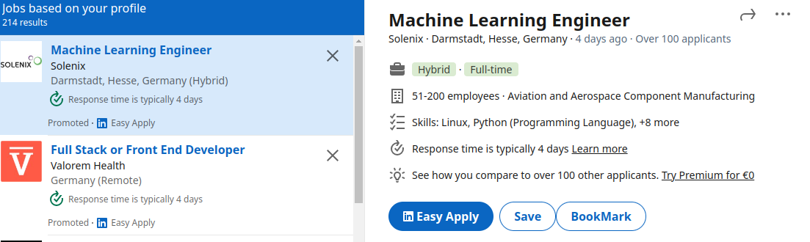

<h1 align="center">
  <br>
  <a href="https://amirbahador-hub.github.io/linkedin_assistent/"></a>
</h1>

<h4 align="center">Linkedin Assistent is an chrome extention that you can use to bookmark your jobs</h4>


<p align="center">
  <a href="#installation">Installation</a> •
  <a href="#usage">Usage</a> •
</p>

## Installation
```bash
```

## Usage
